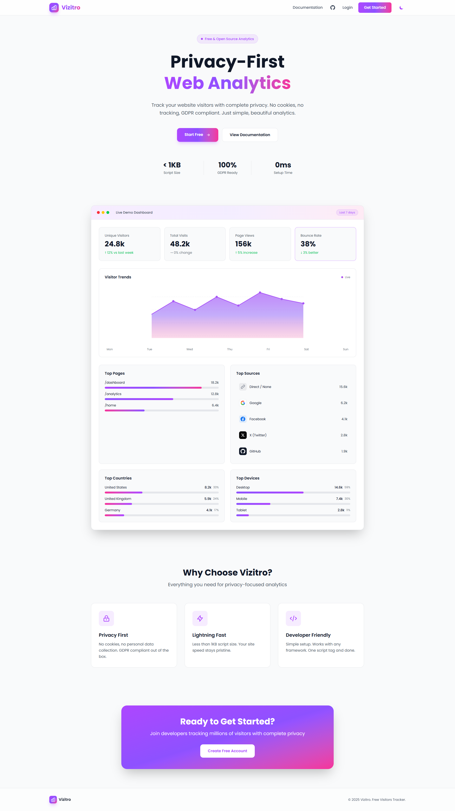

# 🎯 Vizitro - Privacy-Focused Analytics Platform

A lightweight, privacy-friendly web analytics platform built with modern technologies. Track website visitors without compromising user privacy.

🌐 **Live Demo:** [https://vizitro.com](https://vizitro.com)

> **Note:** This repository contains code examples and documentation for portfolio purposes. The complete application source code is proprietary.

[](https://www.typescriptlang.org/)
[](https://nestjs.com/)
[](https://angular.io/)
[](https://www.mysql.com/)
[](https://tailwindcss.com/)

## 📸 Screenshot



## 📋 Table of Contents

- [Features](#features)
- [Tech Stack](#tech-stack)
- [Quick Start](#quick-start)
- [API Documentation](#api-documentation)
- [Code Examples](#code-examples)
- [Database Schema](#database-schema)
- [Security & Privacy](#security--privacy)

## ✨ Features

### Core Functionality
- **Real-time Analytics** - Track page views, unique visitors, and user behavior
- **Geo-location Tracking** - Automatic IP-based location detection (country, city, timezone)
- **Device Intelligence** - Browser, OS, and device type identification
- **Framework Agnostic** - Single script tag works with any framework (React, Angular, Vue, WordPress)

### User Management
- **JWT Authentication** - Secure registration and login system
- **API Key Management** - Generate and manage multiple tracking keys
- **Multi-website Support** - Track multiple websites from one dashboard

### Dashboard Features
- **Interactive Charts** - Real-time data visualization with ApexCharts
- **Date Range Filtering** - Analyze data for custom time periods
- **Top Pages Analytics** - See most visited pages
- **Traffic Sources** - Understand where visitors come from
- **Geographic Insights** - Visitor distribution by country
- **Device Breakdown** - Desktop vs Mobile vs Tablet analytics

### Privacy & Compliance
- **GDPR Compliant** - No cookies, privacy-friendly tracking
- **IP Hashing Option** - Optional IP address anonymization
- **Session Storage** - Uses sessionStorage instead of cookies
- **Data Deletion** - Users can delete their data on request

## 🛠 Tech Stack

### Backend
- **Framework:** NestJS (Node.js)
- **ORM:** TypeORM
- **Database:** MySQL
- **Authentication:** JWT + Passport
- **Security:** bcrypt, helmet
- **Validation:** class-validator
- **HTTP Client:** axios

### Frontend
- **Framework:** Angular 17+
- **Charts:** ApexCharts (ng-apexcharts)
- **State:** RxJS
- **HTTP:** Angular HttpClient
- **UI:** Tailwind CSS

### Tracker
- **Language:** Vanilla JavaScript
- **Size:** ~2KB minified
- **Storage:** sessionStorage (no cookies)

### DevOps
- **Containerization:** Docker
- **Deployment:** Railway / DigitalOcean
- **CI/CD:** GitHub Actions

## 🚀 Quick Start

### Installation on Your Website

Add this single script to your website's `<head>`:
```html
<script 
  src="https://vizitro.com/tracker.js" 
  data-api-key="vzt_your_api_key_here"
  defer>
</script>
