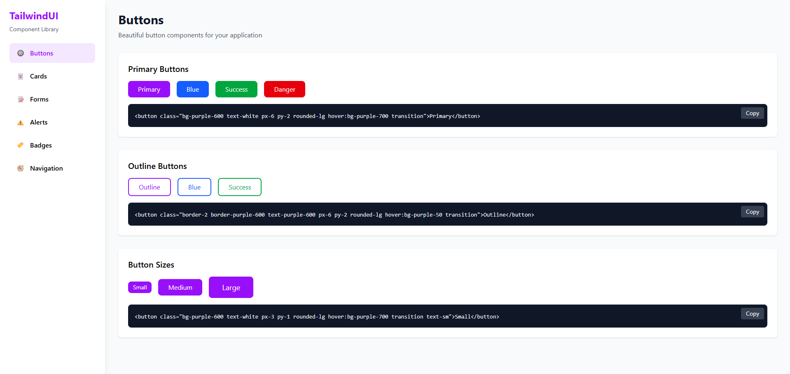

# Tailwind CSS Component Library for Angular

A beautiful, ready-to-use component library built with Tailwind CSS for Angular applications. Copy and paste components directly into your project.



## Features

✨ **Easy to Use** - Click to copy any component code  
🎨 **Beautiful Design** - Modern, clean components with Tailwind CSS  
📱 **Responsive** - All components work on mobile, tablet, and desktop  
🚀 **No Dependencies** - Just Tailwind CSS and Angular  

## Components Included

- **Buttons** - Primary, outline, and various sizes
- **Cards** - Simple cards, feature cards, and stats cards
- **Forms** - Inputs, textareas, and select dropdowns
- **Alerts** - Success, error, warning, and info alerts
- **Badges** - Color badges, solid badges, and pill badges
- **Navigation** - Navbar, tabs, breadcrumbs, and pagination

## Installation

1. Clone the repository:
```bash
git clone https://github.com/abdoMarrouss/tailwind-css-angular-template
cd tailwind-css-angular-template
```

2. Install dependencies:
```bash
npm install
```

3. Run the development server:
```bash
ng serve
```

4. Open your browser and navigate to `http://localhost:4200`

## Usage

1. Browse the components in the sidebar
2. Click on any component category
3. Click the "Copy" button to copy the component code
4. Paste it into your Angular project

## Requirements

- Angular 19+
- Tailwind CSS 4+


## Contributing

Contributions are welcome! Feel free to submit a pull request.

## License

MIT License - feel free to use this in your projects!

## Author

Marrouss Abdelilah - [AbdoMarrouss](https://github.com/abdoMarrouss)

---

⭐ If you find this useful, please give it a star!
